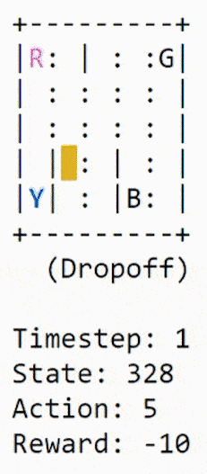

The aim of this repo is to solve the **openAI Taxi-v2** environment using **Q-learning**.

**Environment:**

There are 4 locations (labeled by different letters) and the agent's job is to pick up the passenger at one location and drop him off in another.

```
+---------+
|R: | : :G|   R, G, B, Y are locations on this map
| : : : : |   The pipe symbol (|) represent walls
| : : : : |   The colon symbol (:) represent open spaces
| | : | : |
|Y| : |B: |
+---------+ 
```

The agent receives +20 points for a successful dropoff, and loses 1 point for every timestep it takes.
There is also a 10 point penalty for illegal pick-up and drop-off actions.

**State space and action space**:

The state space is finite and has 25x5x4 = 300 possible values:
- 25 is the number of possible taxi positions in a 5x5 grid
- 5 is the number of possible passenger positions (R, G, B, Y and inside the taxi)
- 4 is the number of possible target positions (where the passenger wants to go)

The agent can then perform 6 different actions at any point in time:
- move south
- move north
- move west
- move east
- pickup the passenger
- dropoff the passenger

**Algorithm:**

<p align="center">
  
</p>
